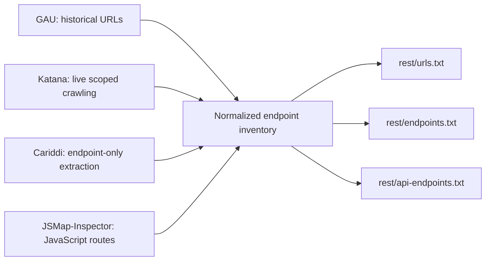
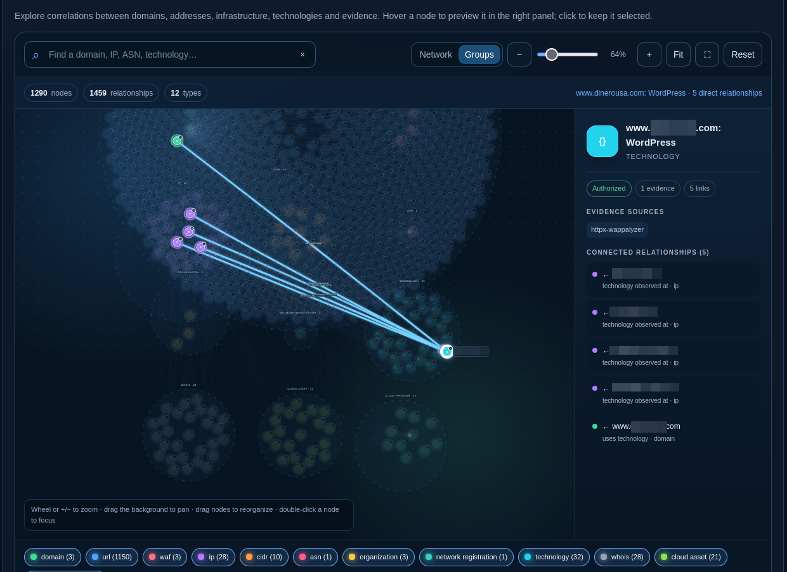

# Cachaza

> Passive-first OSINT and authorized reconnaissance orchestration for Kali Linux.

[](https://www.python.org/)
[](https://www.kali.org/)
[](LICENSE)

```text
                             .-========-.
                              \   o   /
                               \     /
                                `---'
                                  ||
                                  ||
                                __||__
                               /______\

_________     _____  _________   ___ ___    _____  __________  _____
\_   ___ \   /  _  \ \_   ___ \ /   |   \  /  _  \ \____    / /  _  \
/    \  \/  /  /_\  \/    \  \//    ~    \/  /_\  \  /     / /  /_\  \
\     \____/    |    \     \___\    Y    /    |    \/     /_/    |    \
 \______  /\____|__  /\______  /\___|_  /\____|__  /_______ \____|__  /
        \/         \/        \/       \/         \/        \/       \/
                   github.com/W4RRR/cachaza by W4RRR
                                v0.10.5
```

Cachaza turns an explicitly defined domain or network scope into a reproducible reconnaissance workspace. It collects passive intelligence first, applies scope decisions to every observation, and requires explicit authorization before direct-contact stages run.

All observations use one normalized evidence model with source, scope, metadata, and timestamp. Cachaza then produces machine-readable inventories and self-contained reports without treating candidate findings as confirmed vulnerabilities.

> [!IMPORTANT]
> Use Cachaza only against systems you own or are explicitly authorized to assess. A domain does not automatically authorize related ASNs, prefixes, IP addresses, cloud ranges, or third-party infrastructure. Active stages require `-active`; automatic Direct-origin validation also requires `-authorized`. Candidate findings are evidence for review, not confirmed vulnerabilities.

## Contents

- [Quick start](#-quick-start)
- [Profiles](#-profiles)
- [Pipeline overview](#-pipeline-overview)
- [Endpoint discovery](#-endpoint-discovery)
- [WAF identification](#-waf-identification)
- [Origin discovery](#-origin-discovery)
- [Scope and authorization](#-scope-and-authorization)
- [Credentials and providers](#-credentials-and-providers)
- [Reports and workspace](#-reports-and-workspace)
- [Command reference](#command-reference)
- [Optional tools](#optional-tools)
- [Development and testing](#-development-and-testing)

## 🔎 What is Cachaza?

Cachaza is a Python CLI for passive OSINT, authorized infrastructure validation, web endpoint mapping, focused WAF identification, and evidence reporting. It is designed for Kali Linux and supports domain-only workflows as well as explicitly supplied ASNs and CIDRs.

The pipeline follows a funnel:

1. Normalize the operator-supplied scope.
2. Collect public and provider-backed intelligence.
3. Preserve inferred infrastructure as candidate evidence.
4. Run bounded direct validation only when authorized.
5. Export reports, inventories, raw artifacts, and resumable stage state.

The canonical evidence stream is `rest/findings.jsonl`. Text inventories and reports are derived views of that stream.

## ✨ Highlights

- **Passive-first collection:** Certificate Transparency, provider APIs, tenant relationships, subdomains, Shodan signatures, network context, cloud classification, and historical URLs.
- **Explicit authorization controls:** `safe`, `full`, and individually selected active stages are blocked without `-active`.
- **Normalized evidence:** Every finding retains its stage, source, kind, value, scope decision, metadata, and observation time.
- **Endpoint inventory:** GAU, Katana, endpoint-only Cariddi, JavaScript analysis, and passive URL sources feed deduplicated URL and API inventories.
- **Focused WAF identification:** wafw00f and one immutable Nuclei WAF template are the defaults; Nmap correlation is optional.
- **Origin correlation:** Candidate origins are collected, filtered, scored, and optionally validated through a separate bounded workflow.
- **Reproducible workspaces:** Reports, raw evidence, command history, scope, and cache-keyed stage checkpoints remain together.
- **Conservative automation:** Native and supported external network operations are rate- and concurrency-bounded, with stricter fixed limits for Nuclei.

## 🚦 What Cachaza does — and does not do

### Cachaza does

- Collect passive OSINT and correlate domains, subdomains, ASNs, prefixes, registrations, IPs, and providers.
- Validate DNS, certificates, ports, and live HTTP services inside authorized scope.
- Build URL, endpoint, API endpoint, technology, and WAF inventories.
- Preserve provenance and distinguish authorized evidence from candidate infrastructure.
- Produce HTML, JSON, TXT, PDF, and CSV reports.
- Resume compatible workspaces without repeating completed stages.
- Discover and score possible Origin infrastructure under explicit filters and request budgets.

### Cachaza does not

- Expand active scope from a domain-derived ASN, CIDR, IP, cloud range, or search result.
- Use Nuclei for vulnerabilities, CVEs, exposures, login panels, CORS, misconfigurations, endpoints, automatic scans, workflows, or general templates.
- Convert candidate findings into confirmed vulnerabilities.
- Treat an archived URL as evidence that the URL is currently live.
- Exploit observed weaknesses or run unbounded path fuzzing.
- Attempt to defeat mTLS, Authenticated Origin Pulls, network ACLs, or Cloudflare Tunnel.
- Claim that a high-confidence Origin correlation proves ownership or authorization.

Explicit `bypass`, `policies`, `cve`, and BlackWidow functionality remains available for authorized, focused workflows. Those results are normalized as observations or candidates and are not enabled automatically by the `full` profile.

## ⚡ Quick start

### Requirements

| Requirement | Purpose |
|---|---|
| Kali Linux | Supported operating environment |
| Python 3.11 or newer | Core Cachaza package |
| Git | Clone and checkout-based updates |
| pipx | Isolated CLI installation |
| Go | Optional; required only to install Go-based external adapters |

### Install on Kali Linux

Install the Python application first:

```bash
sudo apt update
sudo apt install -y git pipx python3-venv
pipx ensurepath

mkdir -p ~/tools
git clone https://github.com/W4RRR/cachaza.git ~/tools/cachaza
cd ~/tools/cachaza
pipx install .

cachaza -version
cachaza doctor
```

To install supported Go and user-space adapters as well:

```bash
sudo apt install -y golang-go
cachaza doctor -install
cachaza doctor
```

Open a new shell if `pipx ensurepath` changed your `PATH`. `doctor -install` does not invoke `sudo`; Kali system packages remain under administrator control.

### First passive run

The default profile is `passive`:

```bash
cachaza run -d example.com -o example-passive
```

A simple output name is created under `./output`, so this writes to `./output/example-passive`. The default report formats are JSON and TXT.

### First authorized run

```bash
cachaza run -d example.com -profile safe -active -format all -o example-safe
```

### Preview a run

`plan` validates scope and prints the ordered workflow without executing pipeline stages or creating a run workspace:

```bash
cachaza plan -d example.com -profile full
```

`-dry-run` creates the workspace, reports, artifact lists, and external command history without executing pipeline network or tool operations:

```bash
cachaza run -d example.com -profile full -active -dry-run -v -o example-full-plan
```

## 🧭 Profiles

| Profile | Direct contact | Authorization | Purpose | Main stages |
|---|---:|---|---|---|
| `passive` | No target application or network validation | None | Public OSINT, infrastructure context, and historical URLs | Corporate/ASN/tenant, CT/API, subdomains, Shodan/cloud, GAU |
| `safe` | Yes | `-active` | Passive funnel plus bounded certificate, DNS, port, and HTTP validation | `passive` stages plus `certificates`, `dns`, `ports`, `http` |
| `full` | Yes | `-active` | Safe reconnaissance plus endpoint mapping and focused WAF identification | `safe` stages plus `crawl`, `js`, `waf` |

`passive` is the default. The exact stage order is defined in `src/cachaza/profiles.py`; in `full`, `http` runs before `waf` so confirmed live HTTP origins can be reused.

The `full` profile:

- includes GAU, crawling, JavaScript mapping, and focused WAF identification;
- does not contain a general `nuclei` stage;
- does not automatically select `bypass`, `policies`, or `cve`;
- does not automatically enable `-harvester`, `-dns-enum`, or `-blw`.

Use `-stages` to replace the profile stage list and `-skip-stages` to remove selected stages:

```bash
cachaza run -d example.com -stages http,gau,crawl,js,waf -active -o focused-web
```

An explicit active stage still requires `-active`. `-stages nuclei` is rejected with guidance to use the WAF stage instead.

## 🧱 Pipeline overview

### Passive discovery

| Stage | Purpose |
|---|---|
| `corporate` | Writes low-frequency corporate, BGP, registry, and verification handoffs. |
| `asn` | Correlates DNS, BGP Toolkit, RIPEstat, ARIN RDAP, and optional ASNmap evidence. Domain-derived networks remain candidates. |
| `tenant` | Discovers related Microsoft 365 domains without extending scope. |
| `ct` | Queries Cert Spotter and `crt.sh` independently. |
| `api` | Queries configured Censys Platform, IntelX Phonebook, and urlscan sources and records provider status. |
| `subdomains` | Runs passive Subfinder, Assetfinder, or BBOT enumeration with source provenance. |
| `shodan` | Generates signatures and optionally performs bounded count or search API requests. |
| `cloud` | Classifies existing IP/CIDR evidence against public cloud ranges; it does not discover active scope. |
| `gau` | Collects historical URLs and API-path hints; it does not mark them live. |

### Authorized validation

| Stage | Purpose |
|---|---|
| `certificates` | Uses Caduceus against explicitly authorized CIDRs. |
| `dns` | Validates authorized names with dnsx. |
| `ports` | Uses Naabu for authorized domains, Smap for passive Shodan-backed evidence, and optional Nmap for authorized CIDRs. |
| `http` | Uses httpx to record live URLs, status, redirects, IPs, CNAMEs, CDN/ASN context, servers, and technologies. |
| `active` | Compatibility stage for explicitly selected httpx, Naabu, Caduceus, or Nmap adapters. |

### Web mapping and explicit correlation

| Stage | Purpose |
|---|---|
| `crawl` | Runs bounded, FQDN-scoped Katana or endpoint-only Cariddi crawling. |
| `js` | Extracts URLs, routes, related JavaScript, and API hints from JavaScript/source-map analysis. |
| `waf` | Identifies WAF presence/vendor through wafw00f, the single Nuclei WAF template, and optional Nmap NSE. |
| `bypass` | Records possible 403 bypass observations as candidates requiring manual validation. |
| `policies` | Collects CSP observations and favicon fingerprints. |
| `cve` | Correlates observed technologies with Vulnx as CVE candidates; it does not confirm vulnerability. |
| `origin` | Collects and scores Origin candidates, with optional bounded Direct-origin validation. |

### Focused add-ons

| Stage or option | Purpose | Gate |
|---|---|---|
| `harvester` / `-harvester` | theHarvester organization, contact, host, API, and takeover evidence | `-active` |
| `dns_enum` / `-dns-enum` | dnsenum/Fierce discovery and explicit AXFR observations | `-active` |
| `blackwidow` / `-blw LEVEL` | BlackWidow crawling and Inject-X candidates at depth 1–10 | `-active` |
| `wappalyzer` / `-wappalyzer` | Reuses httpx Wappalyzer fingerprints for technology evidence | `-active` |
| `whois` / `-whois` | WHOIS enrichment once per unique public IP | None |

Stages are fault-isolated unless `-strict` is selected. A compatible resumed workspace reuses cache-keyed successful stages from `rest/stages/`.

## 🌐 Endpoint discovery



| Source | Activity | Behavior |
|---|---|---|
| GAU | Passive | Preserves full historical URL, host, path, provenance, and API-path hints. |
| Katana | Active | Crawls confirmed origins within FQDN scope, depth 3, with bounded rate/concurrency and JSONL status/method evidence. |
| Cariddi | Active | Uses endpoint-only output (`-e -plain`) with concurrency 1; secret hunting (`-s`) is not enabled. |
| JSMap-Inspector | Active | Extracts same-origin source-map URLs, routes, related JavaScript, and Swagger/OpenAPI/GraphQL-style API paths. |

> [!NOTE]
> A GAU result is historical evidence, not proof of a live URL. Live-origin selection requires httpx status evidence, a crawler 2xx/3xx response, or another validated HTTP response.

Nuclei does not participate in endpoint discovery. The workspace normalizes and deduplicates endpoint URLs by:

- retaining scheme, hostname, non-default port, and path;
- removing fragments;
- removing query values;
- retaining unique query parameter names in sorted order.

For example:

```text
https://example.com/search?q=term&page=2#results
→ https://example.com/search?page&q
```

`rest/api-endpoints.txt` includes explicit `api_endpoint` findings and URL findings marked as API endpoints by GAU, crawlers, or JavaScript analysis.

### Focused endpoint example

```bash
cachaza run -d example.com -stages http,gau,crawl,js -crawl-tools katana -active -format all -o example-endpoints
```

## 🛡️ WAF identification

> [!NOTE]
> Cachaza restricts Nuclei to `http/technologies/waf-detect.yaml`. It does not run general, CVE, exposure, login, CORS, misconfiguration, workflow, automatic-scan, or vulnerability templates.

| Adapter | Selection | Behavior |
|---|---|---|
| wafw00f | Default | Broad WAF fingerprinting against one normalized HTTP origin at a time. |
| Nuclei `waf-detect` | Default | Runs the immutable WAF template with rate, bulk size, and concurrency fixed at 1 and retries fixed at 0. |
| Nmap NSE | Optional | Correlates `http-waf-detect` and intensive `http-waf-fingerprint` when `nmap` is explicitly added. |

WAF targets are normalized to `scheme + hostname + effective port`:

```text
https://api.example.com/
https://api.example.com/login
https://api.example.com/v1/users?id=7
https://api.example.com:443/swagger/
→ https://api.example.com
```

Cachaza runs the WAF adapters once per deduplicated live HTTP origin, not once per endpoint. A non-standard port is retained only when httpx or a crawler confirms an HTTP(S) URL on that port. DNS records, Naabu services, Nmap services without URLs, and unverified historical URLs do not become WAF targets.

When `waf` runs alone without live URL evidence, the conservative fallback is the root domain over HTTPS only. It does not invent HTTP or alternate-port variants.

### Focused WAF example

```bash
cachaza run -d example.com -stages waf -waf-tools wafw00f,nuclei -active -format all -o example-waf
```

Add `nmap` only for explicit NSE correlation:

```bash
cachaza run -d example.com -stages waf -waf-tools wafw00f,nuclei,nmap -active -o example-waf-nmap
```

WAF findings retain the target origin, vendor, source, confidence, and bounded evidence. Reports distinguish an identified vendor, a WAF with unknown vendor, and no observed WAF evidence. A negative result does not prove that no WAF is present.

## 🕵️ Origin discovery

Origin discovery is separate from the general active pipeline. It collects candidate IPs from existing evidence and configured sources, rejects unsuitable infrastructure, applies deterministic scores, and optionally performs low-impact Direct-origin validation.

| Mode | Direct validation | Default boundary | Required gate |
|---|---:|---|---|
| `passive` | No | Collect and rank candidates only | None |
| `balanced` | Yes | Up to 10 candidates, 40 total requests, ports 80/443 | `-active -authorized` |
| `deep` | Yes | Up to 20 candidates, 100 total requests, bounded alternate web ports, optional JARM | `-active -authorized` |

Disable direct validation in any mode with `-origin-no-direct-validation`.

### Passive candidate discovery

```bash
cachaza run -d example.com -origin-auto -origin-mode passive -o example-origin-passive
```

### Authorized balanced validation

```bash
cachaza run -d example.com -origin-auto -origin-mode balanced -active -authorized -o example-origin
```

### Bounded deep validation

```bash
cachaza run -d example.com -origin-auto -origin-mode deep -origin-max-auto-candidates 20 -origin-max-requests 100 -origin-rate-limit 1 -origin-concurrency 2 -active -authorized -o example-origin-deep
```

### What Direct-origin validation checks

- TCP connectivity on the configured web ports.
- TLS with the target hostname as SNI.
- HTTP with the same hostname in `Host`.
- HEAD and bounded GET requests to `/`, approved paths, and a small set of already observed favicon/static resources.
- Correlation of status, redirects, stable headers, cookie names, title, body/static hashes, and certificate evidence.
- Optional single-host JARM correlation through TLSX in deep mode.

### What it never does

- Send POST requests, authentication, forged client-IP headers, or origin-bypass headers.
- Run Nuclei, Arjun, fuzzing, exploitation, SSRF, or proxy-based checks against a candidate.
- Scan an entire inferred CIDR or ASN.
- Attempt to bypass mTLS, Authenticated Origin Pulls, ACLs, or Tunnel controls.
- Invent an origin when evidence is insufficient or no public origin exists.

> [!NOTE]
> A high-confidence Origin result is a technical correlation. It is not proof of ownership, scope, or permission for additional testing.

Origin artifacts are stored under `rest/origin/`, including the public baseline, all/selected/rejected candidates, validation evidence, network classification, request budget, and final JSON/CSV ranking. Response bodies are stored only when `-origin-save-bodies` is explicit.

Cloudflare deployments require careful interpretation: proxied DNS returns edge addresses; an origin ACL may allow only Cloudflare ranges; Authenticated Origin Pulls may require a client certificate; and Cloudflare Tunnel may expose no public origin at all. See Cloudflare's documentation for [proxy status](https://developers.cloudflare.com/dns/proxy-status/), [exposed IP addresses](https://developers.cloudflare.com/dns/manage-dns-records/troubleshooting/exposed-ip-address/), [IP ranges and origin ACLs](https://developers.cloudflare.com/fundamentals/concepts/cloudflare-ip-addresses/), [Authenticated Origin Pulls](https://developers.cloudflare.com/ssl/origin-configuration/authenticated-origin-pull/explanation/), and [Cloudflare Tunnel](https://developers.cloudflare.com/cloudflare-one/networks/connectors/cloudflare-tunnel/).

The complete scoring and evidence model is documented in [docs/METHODOLOGY.md](docs/METHODOLOGY.md).

## 🎯 Scope and authorization

| Input | Scope effect |
|---|---|
| `-d example.com` | Authorizes the root domain and non-excluded subdomains, not related apex domains or infrastructure. |
| `-cidr 192.0.2.0/28` | Explicitly authorizes addresses inside the CIDR, minus exclusions. |
| `-a AS64500` | Treats that ASN as explicit input and may mark its discovered prefixes in scope; use only when the ASN is part of written scope. |
| `-org "Example Organization"` | Adds an intelligence hint; it does not authorize inferred networks. |
| `-exclude-domain` / `-exclude-cidr` | Removes values from the applicable scope. |

Domain-derived ASNs, prefixes, cloud ranges, CDN addresses, Shodan matches, tenant domains, historical IPs, and registry data remain candidate evidence. They do not enter general active stages automatically.

For larger engagements, use a target file:

```text
domain: example.com
asn: AS64500
org: Example Organization
cidr: 192.0.2.0/28
exclude-domain: dev.example.com
exclude-cidr: 192.0.2.8/29
```

```bash
cachaza run -targets-file scope.txt -profile safe -active -o example-scope
```

`-active` authorizes direct-contact stages against the explicit scope. `-authorized` is an additional acknowledgement for automatic Direct-origin validation; it does not broaden the general pipeline.

> [!WARNING]
> `-allow-large-ranges` bypasses the configured active host-count limit and requires `-active`. Use it only when the complete range is explicitly authorized and the engagement can safely absorb the traffic.

## 🔑 Credentials and providers

Cachaza accepts exported environment variables or a data-only `KEY=value` file. The file is parsed; it is never executed.

```bash
cp config/providers.example.env config/providers.env
chmod 600 config/providers.env

cachaza doctor -api-config config/providers.env
cachaza run -d example.com -api-config config/providers.env -o example-passive
```

Common variables include:

| Variable | Used for |
|---|---|
| `PDCP_API_KEY` | ProjectDiscovery services such as optional ASNmap/provider integration |
| `SHODAN_API_KEY` | Shodan count/search and supported adapters |
| `CERTSPOTTER_API_KEY` | Optional authenticated Cert Spotter access |
| `CENSYS_API_KEY` | Native Censys Platform global-search PAT |
| `CENSYS_ORG_ID` | Optional native Censys organization context |
| `INTELX_HOST` | Exact IntelX API URL assigned in Account > Developer |
| `INTELX_API_KEY` | IntelX Phonebook and supported provider configuration |
| `URLSCAN_API_KEY` | urlscan search |
| `VT_API_KEY` | Optional VirusTotal historical DNS for Origin discovery |
| `SECURITYTRAILS_API_KEY` | Optional SecurityTrails/Origin evidence |

The full supported set is documented in `config/providers.example.env`. `CENSYS_API_KEY` is a
current Platform Personal Access Token sent as a Bearer token; theHarvester's legacy connector
uses the separate `CENSYS_API_ID` and `CENSYS_API_SECRET` pair. A Censys `401` means the PAT is
invalid. A `403` means it was accepted but the account is not entitled to Global Search: Free
accounts have lookup-only API access, while Starter/Search/Core organization access also requires
the API Access role and normally `CENSYS_ORG_ID`.

IntelX keys are tied to the API URL shown in the account Developer tab. Set both values exactly;
for example, a key issued for `https://free.intelx.io` must not be sent to `2.intelx.io`:

```dotenv
INTELX_HOST=https://free.intelx.io
INTELX_API_KEY=your_account_key
```

Before Phonebook search, Cachaza calls IntelX `/authenticate/info` and verifies that the key is
authorized for `/phonebook/search`. Phonebook uses `target=0` so domains, email addresses, and URLs
are all eligible instead of requesting email selectors only.

> [!WARNING]
> Provider coverage depends on credentials, account permissions, indexing, and quotas. `-shodan-mode count` avoids search-result credits; `search` retrieves results and may consume credits. `doctor` confirms that a value is present, not that the provider accepts it.

Each run records native provider outcomes and safe diagnostics under `rest/api/provider-status.json`.
Certificate Transparency availability, retrieved-name counts, and newly added evidence counts are
recorded separately under `rest/ct/source-status.json`. Missing tools, credentials, or one degraded
source can produce an incomplete inventory without invalidating evidence collected elsewhere.

## VPN-safe network policy

Cachaza enforces a product-wide ceiling of two request/packet starts per second and two concurrent network workers for its native operations. Supported external commands are rewritten where their CLI exposes relevant controls:

- Subfinder and dnsx rate/threads are capped at 2.
- Katana rate, concurrency, and parallelism are capped at 2.
- httpx, Naabu, Nmap, Caduceus, and TLSX receive bounded native options.
- Common subprocess worker-pool environment variables are forced to 2.
- Nuclei is stricter: rate, bulk size, and concurrency are fixed at 1, with zero retries and one WAF template.

The CLI rejects `-jobs`, `-rate-limit`, subdomain, or Origin limits above 2 instead of accepting an unsafe value.

Some third-party programs do not expose a trustworthy requests-per-second option. Cachaza can bound process starts and common worker pools but cannot inspect every upstream internal scheduler. Select adapters with native limits when a strict traffic contract is required.

These controls reduce burst load; they do not alter tunnel MTU or TCP MSS. If a VPN still drops at low request rates, diagnose path MTU and tunnel configuration separately.

## Active controls and focused bundles

The global limits can be tightened for an engagement:

```bash
cachaza run -d example.com -profile full -active -ports 80,443,8080,8443 -rate-limit 1 -max-active-hosts 256 -max-crawl-urls 25 -format all -o example-controlled
```

| Shortcut | Activity | Effect |
|---|---|---|
| `-s` / `-subdomains` | Passive | Ensures Subfinder and Assetfinder are selected. |
| `-w` / `-waf` | Active | Adds focused WAF identification. It is already present in `full`. |
| `-harvester` | Active | Adds theHarvester organization, contact, host, API, and takeover evidence. |
| `-dns-enum` | Active | Adds dnsenum and Fierce with explicit AXFR reporting. |
| `-blw LEVEL` | Active | Adds BlackWidow at depth 1–10; Inject-X output remains candidate evidence. |
| `-wappalyzer` | Active | Adds httpx technology fingerprints without a duplicate probe when httpx already ran. |
| `-whois` | Passive/public lookup | Enriches each unique public IP once. |

All active bundles require written authorization and `-active`. The `full` profile already contains `waf`, but it does not implicitly enable theHarvester, DNS enumeration, or BlackWidow.

## 📊 Reports and workspace

Default runs write JSON and TXT reports. Use `-format all` for every supported format:

| Format | Content |
|---|---|
| HTML | Self-contained searchable evidence, filters, expandable metadata, and relationship graph |
| JSON | Lossless scope, findings, graph, network intelligence, stages, and executive categories |
| TXT | Terminal-friendly summary, inventory, stages, and evidence |
| CSV | One normalized row per finding with spreadsheet formula-prefix neutralization |
| PDF | Shareable summary, scope, infrastructure tables, stages, inventory, and bounded evidence appendix |

The terminal and TXT `KEY FINDINGS` summary keeps high-signal evidence readable:
WAF products are grouped with one origin per line, actionable subdomains are split
into HTTP-responsive and DNS-only groups, and unverified or wildcard-like names are
reduced to an omitted-candidate counter. Generic WAF signatures are labeled as
candidates when manual validation is required.

### HTML relationship explorer

The self-contained HTML report is one of Cachaza's primary analysis surfaces. Its interactive graph connects domains, URLs, IP addresses, networks, technologies, WAF observations, registrations, and evidence sources while preserving the scope and provenance of each node.



*Example relationship graph with identifying target values redacted.*

```bash
cachaza run -d example.com -format all -o example-run
```

The resulting layout is:

```text
output/example-run/
├── report.html
├── report.json
├── report.txt
├── report.pdf
├── report.csv
└── rest/
    ├── findings.jsonl
    ├── manifest.json
    ├── scope.json
    ├── urls.txt
    ├── endpoints.txt
    ├── api-endpoints.txt
    ├── wafs.txt
    ├── api/
    ├── origin/
    └── stages/
```

Only selected report formats appear. Artifact directories such as `api/` or `origin/` are present only when the related workflow writes them. Convenience lists are derived from `rest/findings.jsonl`.

Security-sensitive report handling includes HTML escaping, restrictive Content Security Policy, inert embedded JSON, secret redaction where supported, and CSV formula-injection neutralization.

### Resume and fresh runs

Reusing a compatible `-o` workspace continues it automatically. `-resume` requires that the workspace already exists; `-fresh` resets only a recognizable Cachaza workspace whose saved scope matches the current request.

```bash
cachaza run -d example.com -profile passive -o example-run
cachaza run -d example.com -profile full -active -o example-run -resume
```

Changing scope in an existing workspace is rejected to prevent evidence from unrelated engagements being mixed.

## Command reference

| Command | Purpose |
|---|---|
| `cachaza run` | Execute a profile or explicit stage list and write a workspace. |
| `cachaza plan` | Validate scope and show ordered stages without network calls or files. |
| `cachaza signatures` | Build Karma/Shodan queries from domains, organizations, or certificate fingerprints. |
| `cachaza normalize` | Extract, validate, filter, sort, and deduplicate domains from text or JSON. |
| `cachaza monitor` | Monitor Certificate Transparency through Gungnir or Cert Spotter/`crt.sh` polling. |
| `cachaza doctor` | Report optional tool paths and credential presence; optionally install supported tools. |

Useful option groups:

| Purpose | Options |
|---|---|
| Core inputs | `-d`, `-a`, `-org`, `-cidr`, `-targets-file`, exclusions |
| Profiles and stages | `-profile`, `-stages`, `-skip-stages` |
| Authorization and safety | `-active`, `-authorized`, `-rate-limit`, `-jobs`, `-max-active-hosts` |
| Output and state | `-o`, `-format`, `-resume`, `-fresh`, `-dry-run`, `-strict` |
| Endpoint mapping | `-crawl-tools`, `-max-crawl-urls`, `-jsmap-path` |
| WAF identification | `-w`, `-waf-tools` |
| Origin discovery | `-origin-auto`, `-origin-mode`, `-origin-no-direct-validation`, bounded `-origin-*` controls |
| Providers | `-api-config`, `-shodan-mode`, `-shodan-pages`, `-shodan-max-queries` |
| Diagnostics and updates | `doctor`, `doctor -install`, `-version`, `-up`, `-update` |

Both single- and double-dash option spellings are accepted. Consult the live CLI for the complete reference:

```bash
cachaza --help
cachaza run --help
cachaza doctor --help
```

## Optional tools

Cachaza runs available adapters and records missing components through `doctor`. External tools are not Python core requirements.

| Purpose | Tools |
|---|---|
| Network context | ASNmap, WHOIS |
| Subdomains | Subfinder, Assetfinder, BBOT |
| DNS | dnsx, dnsenum, Fierce, optional PureDNS |
| Ports | Naabu, Nmap, Smap |
| HTTP | httpx |
| Crawling | Katana, Cariddi, BlackWidow |
| WAF | wafw00f, Nuclei WAF template, optional Nmap NSE |
| JavaScript | Bundled `JSMap-Inspector` CLI |
| Origin correlation | AlterX, PureDNS/dnsx, Uncover, optional TLSX/JARM |
| Organization/contact | theHarvester |
| Policy/fingerprint | CSP-Stalker, Favicorn |

`cachaza doctor -install` installs absent tools for which Cachaza has an approved user-space recipe:

- Go binaries are placed in `~/.local/bin` when Go is available.
- BBOT and wafw00f are installed through pipx.
- Pinned BlackWidow and CSP-Stalker copies are installed under the user's Cachaza data directory.
- The bundled source-map analyzer is exposed as `JSMap-Inspector`.
- Existing executables are not replaced.

Nmap, WHOIS, Smap, Gungnir, Favicorn, theHarvester, dnsenum, Fierce, and other Kali/system tools remain explicit administrator or specialist installations.

See [docs/OPTIONAL_TOOLS.md](docs/OPTIONAL_TOOLS.md) for installation recipes, pinned revisions, and adapter interfaces.

## Updating Cachaza

The aliases `cachaza -up` and `cachaza -update` run the same conservative update workflow.

- From a Git checkout, Cachaza runs `git pull --ff-only origin main`, then reinstalls the checkout with `pipx install --force .`.
- Without a checkout, it reinstalls from `git+https://github.com/W4RRR/cachaza.git` through pipx.
- After installation, it prints the version and runs `cachaza doctor` when the executable is visible on `PATH`.
- The workflow does not run `git reset`, force-push, or a non-fast-forward merge.

```bash
cachaza -up
cachaza -update
```

Both commands are equivalent.

Normal CLI invocations check the latest public version at most once every 24 hours and cache the result. An interactive terminal can accept an update prompt; non-interactive runs print guidance and continue. Disable that network check and cache access in controlled or offline environments with:

```bash
export CACHAZA_SKIP_UPDATE_CHECK=1
```

## 🧪 Development and testing

Python 3.11 or newer is required. The `dev` extra includes pytest:

```bash
git clone https://github.com/W4RRR/cachaza.git
cd cachaza

python -m venv .venv
source .venv/bin/activate
python -m pip install -e ".[dev]"
python -m pytest -q
```

Before submitting changes:

```bash
python -m pytest -q
git diff --check
grep -RIn "nuclei" README.md docs src tests
```

Tests use temporary workspaces, mocks, dry runs, and simulated adapter output for behavior that must not contact real targets. Keep new network-facing tests isolated in the same way.

## Contributing

Keep changes scoped, preserve passive-first defaults, and add tests for new parsing, safety, scope, or command behavior. Update the README and the relevant document under `docs/` when a user-visible workflow changes.

Do not commit provider credentials, generated workspaces, or report artifacts. Review `git diff --check` and run the complete test suite before opening a pull request.

## 📄 License

Cachaza is released under the [MIT License](LICENSE).
